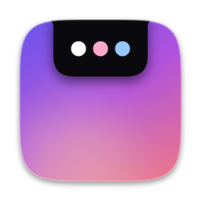
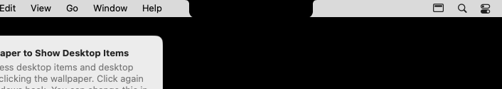
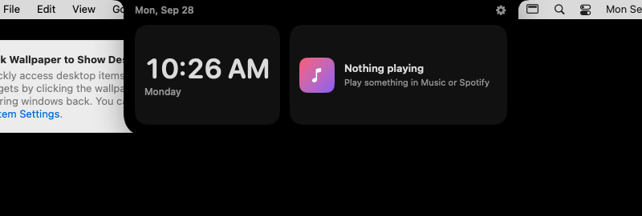
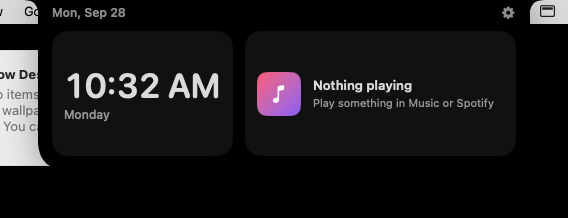
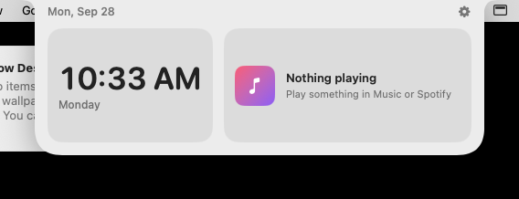
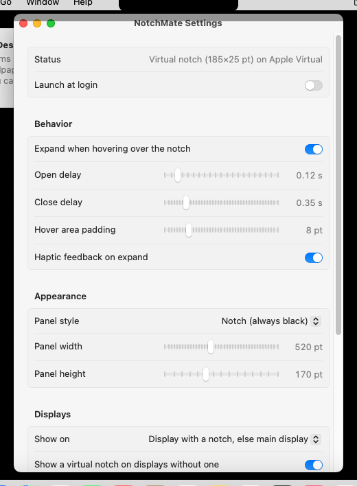

<p align="center">
  
</p>

<h1 align="center">NotchMate</h1>

<p align="center">
  A free, open-source notch companion for macOS.<br>
  Hover the MacBook notch to reveal a clock, your battery and what's playing, then move away and it hides again.
</p>

<p align="center">
  <a href="https://github.com/AshkanWatson/NotchMate/actions/workflows/ci.yml"></a>
  <a href="https://github.com/AshkanWatson/NotchMate/releases/latest"></a>
  
  
</p>

---

## What NotchMate does

NotchMate turns the camera housing of a MacBook into a small, useful surface, much like
[NotchNook](https://lo.cafe/notchnook), but open source.

- **Compact state.** When you aren't interacting with it, NotchMate is exactly the size and shape of the
  hardware notch. On a notched MacBook it's invisible.
- **Hover to expand.** Move the pointer to the notch and a panel grows out of it with a spring animation.
- **Leave to collapse.** Move the pointer away (or click anywhere else) and the panel shrinks back into the notch.

It runs as a lightweight menu bar app with no Dock icon. It uses only public macOS APIs, needs no
Accessibility permission, and never collects data.

## Screenshots

> These screenshots come from the real app, captured automatically by the UI tests on a GitHub Actions Mac
> (see [`ScreenshotUITests`](NotchMateUITests/ScreenshotUITests.swift)). CI Macs have no notch, so the
> notch you see is NotchMate's **virtual notch**, which Macs without a notch get too. On a notched
> MacBook the compact state is hidden behind the real notch.

| Compact (notch) state | Hover / expanded state |
|---|---|
|  |  |

**Main interface:** date and battery flank the notch, with the clock and Now Playing below:



**Match system appearance** (optional; the default is notch black):



**Settings:**



## Key features

| | |
|---|---|
| 🎯 **Real notch detection** | Reads the notch geometry from macOS itself, so it has no hard-coded sizes or coordinates. |
| 🖥️ **Any display setup** | Works across resolutions and "More Space" scaling, and with external displays, clamshell mode and display changes while running. |
| ✨ **Native animation** | An interruptible spring morphs the notch into the panel. It respects *Reduce motion*. |
| 🌗 **Light & dark** | The panel stays notch black by default, or can follow the system appearance. Settings and the menu follow the system. |
| 🕒 **Clock & date** | Large clock plus the date beside the notch. |
| 🔋 **Battery** | Charge level and charging state, updated live by IOKit. It hides on Macs without a battery. |
| 🎵 **Now Playing** | Track, artist and play/pause/skip for **Music** and **Spotify**, with animated equalizer dots while playing. |
| 🧩 **Macs without a notch** | Shows a menu-bar-height *virtual notch*, or nothing at all if you prefer. |
| ⚙️ **Configurable** | Hover delays, hover area, panel size, display, widgets, haptics and launch at login. |
| 🪶 **Lightweight** | No third-party dependencies. It does nothing until the pointer reaches the top of the screen. |

## Requirements

**macOS:** macOS 13 Ventura or later. It's tested in CI on the latest macOS runner.

**Hardware and notch behaviour:**

| Mac | Behaviour |
|---|---|
| MacBook Pro 14"/16" (2021+), MacBook Air 13"/15" (M2+) | Detects the hardware notch and fits it exactly. |
| MacBooks without a notch, iMac, Mac mini, Mac Studio, Mac Pro | Shows a *virtual notch* at the top centre of the main display. You can turn it off. |
| Notched MacBook + external display | Uses the notched built-in display by default. You can pin it to the built-in or menu bar display instead. |
| Clamshell mode | Falls back to the display with the menu bar. |

Both Apple silicon and Intel are supported: release builds are universal.

## Installation

1. Download the latest **`NotchMate-x.y.z.dmg`** from the [Releases page](https://github.com/AshkanWatson/NotchMate/releases/latest).
2. Open the DMG and drag **NotchMate** onto **Applications**.
3. Launch NotchMate from Applications. A small notch icon appears in the menu bar.
4. Move your pointer to the notch. 🎉

> **First launch of an unsigned build:** unless a release was signed with a Developer ID (see
> [Distribution](#code-signing--notarization)), macOS Gatekeeper will say the app "cannot be verified". Right-click
> NotchMate in Applications → **Open** → **Open**, or run
> `xattr -dr com.apple.quarantine /Applications/NotchMate.app`. You only need to do this once.

**Permissions**

- **None are needed** for the notch, clock or battery.
- **Automation (Music/Spotify):** the first time Now Playing talks to a running player, macOS asks for permission.
  You can change it later in *System Settings → Privacy & Security → Automation*.
  NotchMate never launches a player itself.

To **start at login**, open *Settings… → Launch at login*. To **uninstall**, quit NotchMate from the menu bar
and move it to the Trash.

## Usage

- **Hover** the notch to expand; **move away** or **click elsewhere** to collapse.
- The **menu bar icon** has *Expand/Collapse Notch*, the current detection status, *Settings…* and *Quit*.
- The **gear** in the expanded panel opens Settings.

## Configuration

Everything lives in **Settings…** (menu bar icon → Settings, or the gear in the panel):

| Setting | Default | Notes |
|---|---|---|
| Expand when hovering over the notch | On | Turn it off to open the panel only from the menu bar. |
| Open delay | 0.12 s | Stops the panel opening when you only pass the top of the screen. |
| Close delay | 0.35 s | A grace period before collapsing if the pointer slips out. |
| Hover area padding | 8 pt | Extra hover area around the notch. |
| Haptic feedback on expand | On | A subtle trackpad tick. |
| Panel style | Notch (black) | Or *Match system appearance*. |
| Panel width / height | 520 × 170 pt | Clamped to fit the display. |
| Show on | Display with a notch, else main display | Or *Built-in display* or *Display with the menu bar*. |
| Virtual notch on displays without one | On | Plus its width. |
| Widgets | All on | Clock, Battery, Now Playing. |

Settings are stored in `UserDefaults` (`io.github.ashkanwatson.NotchMate`). Every setting can be overridden
for a single launch from the command line, which is handy for testing:

```bash
/Applications/NotchMate.app/Contents/MacOS/NotchMate -expandOnHover NO -expandedWidth 600
```

Developer launch switches: `--simulate-notch 185x32`, `--simulate-no-notch`, `--start-expanded`,
`--open-settings`, `--reset-settings`, `--ui-testing` (see [`LaunchOptions.swift`](NotchMate/App/LaunchOptions.swift)).

## How notch detection works

macOS 12 added public APIs that describe the camera housing, and NotchMate uses them directly:

1. **`NSScreen.safeAreaInsets.top`** is non-zero only on a display with a notch. It is the notch height.
2. **`NSScreen.auxiliaryTopLeftArea` / `auxiliaryTopRightArea`** are the usable menu bar strips on each side, so the
   notch is precisely the gap between them: `x = screen.minX + leftWidth`, `width = screen.width − left − right`.
3. **`CGDisplayIsBuiltin`** identifies the built-in panel, so NotchMate picks the right display when several are connected.
4. Geometry is re-read on **`NSApplication.didChangeScreenParametersNotification`**, which fires on resolution changes, display
   (dis)connection, clamshell mode and rearrangement.
5. All rectangles are computed in points and **snapped to the display's pixel grid** (`backingScaleFactor`) so
   edges stay crisp on Retina and scaled resolutions.

Without a notch, a *virtual notch* is placed at the top centre with the height of the menu bar
(`frame.maxY − visibleFrame.maxY`).

### Why the previous version didn't appear around the notch

The original prototype had several problems:

- It used a hard-coded 200 × 30 pt "notch" and a window at `screen.height − 35`. It ignored the real notch geometry,
  the menu bar height and the display origin, so it was misplaced on every model and on multi-display setups.
- It relied on `NSScreen.main`, which is the screen with the *key window*, not the notched display.
- The window was hidden with `orderOut` and shown by a global mouse monitor that stops receiving events once the
  pointer is over the app's own window, so hover in and out was unreliable.
- It animated the *window frame* with a fading alpha (janky), and the pill shape didn't connect to the notch.
- The project targeted iOS/visionOS/macOS 15.5 at once and referenced `MPMusicPlayerController`, which is iOS-only.

## Architecture

```
NotchMate/                     macOS app (AppKit + SwiftUI shell)
├── App/
│   ├── NotchMateApp.swift     @main, MenuBarExtra
│   ├── AppDelegate.swift      wiring, accessory activation policy
│   ├── NotchController.swift  panel ⇄ pointer ⇄ state machine ⇄ UI
│   ├── SettingsModel.swift    observable, persisted settings
│   ├── SettingsWindowController.swift
│   └── LaunchOptions.swift    command-line switches for tests/screenshots
├── Platform/
│   ├── ScreenReader.swift     NSScreen → ScreenDescriptor (+ simulation)
│   ├── NotchPanel.swift       borderless non-activating NSPanel above the menu bar
│   └── PointerMonitor.swift   global + local mouse monitors
├── Services/                  BatteryMonitor (IOKit), NowPlayingService (Apple Events),
│                              LaunchAtLogin (SMAppService), Haptics
└── Views/                     NotchShape, NotchRootView, ExpandedContentView, Widgets,
                               SettingsView, MenuBarContent
Packages/NotchMateKit/         platform-independent core (Foundation only)
├── ScreenDescriptor           value snapshot of a display
├── NotchDetector              notch detection + display selection
├── NotchLayout                compact/expanded/window rects, pixel alignment
├── NotchHitTesting            hover zones + HoverTracker (enter/exit events)
├── NotchStateMachine          collapsed ⇄ expanded with open/close delays, as pure effects
├── NotchSettings/SettingsStore settings model, clamping, persistence
└── BatteryInfo, NowPlayingInfo, NotchAnimation
NotchMateTests/                app unit tests (controller, screen reader, shape, settings)
NotchMateUITests/              UI tests driving the real mouse + screenshot capture
scripts/                       build-release, make-dmg, verify-dmg, test, generate-icon
.github/workflows/             ci.yml (every push/PR), release.yml (tags)
```

**Design choices**

- **All decisions live in `NotchMateKit`**: detection, geometry, hit testing, the state machine and settings. It has
  no AppKit dependency and its timers are modelled as *effects*, so it's fully deterministic and unit tested.
- **The window never resizes.** The panel is sized once for the expanded state. SwiftUI animates the
  `NotchShape` (animatable corner radii) and frame inside it, which is far smoother than animating an `NSWindow`.
- **Clicks pass through when collapsed.** `ignoresMouseEvents` is on while collapsed, so the menu bar under and around
  the notch keeps working.
- **Hover detection without permissions.** `NSEvent` global and local `mouseMoved` monitors (no Accessibility
  permission required) feed `HoverTracker`, plus a low-frequency watchdog while expanded in case an event is missed.

## Developer setup

**Requirements:** Xcode 16 or later (the project uses Xcode 16 folder-synchronised groups), macOS 14+ recommended.
Optional: [SwiftLint](https://github.com/realm/SwiftLint) (`brew install swiftlint`).

```bash
git clone https://github.com/AshkanWatson/NotchMate.git
cd NotchMate
open NotchMate.xcodeproj
```

### Run locally

In Xcode, select the **NotchMate** scheme and **My Mac**, then press **⌘R**. The app appears in the menu bar; hover the notch.
To try the notch path on a Mac without one, edit the scheme's arguments and add `--simulate-notch 185x32`.

From the terminal:

```bash
xcodebuild -project NotchMate.xcodeproj -scheme NotchMate -configuration Debug -derivedDataPath build/DerivedData build
open build/DerivedData/Build/Products/Debug/NotchMate.app
```

Debug builds are signed "to run locally" (ad hoc), so no Apple Developer account is needed. To use your own team,
set it under *Signing & Capabilities*.

### Build

```bash
scripts/build-release.sh 1.2.0        # universal Release build → build/NotchMate.app
scripts/make-dmg.sh build/NotchMate.app 1.2.0   # → dist/NotchMate-1.2.0.dmg (+ .sha256)
scripts/verify-dmg.sh dist/NotchMate-1.2.0.dmg 1.2.0
```

### Testing

```bash
scripts/test.sh          # SwiftLint, core tests, warnings-as-errors build, app unit tests, UI tests
scripts/test.sh --no-ui  # everything except UI tests
swift test --package-path Packages/NotchMateKit   # core logic only (fast, no Xcode project needed)
```

| Suite | What it covers |
|---|---|
| `NotchMateKitTests` (core) | Notch detection on 14"/16" Pro, 13"/15" Air, "More Space" scaling, secondary and asymmetric displays, fallbacks; display selection; layout, clamping and Retina/fractional pixel alignment; hover zones; every state transition, including delays, cancellation, toggles and duplicate events; settings defaults, round trip, clamping and CLI string values; battery and now-playing parsing; animation specs. |
| `NotchMateTests` (app) | `NSScreen` → descriptor mapping on the real display, notch simulation, launch options, `NotchShape` geometry, controller hover → expand → leave → collapse, delays, click outside, virtual notch, no notch, settings re-layout, display change. |
| `NotchMateUITests` | With the real mouse: compact state on launch; hover expands; moving inside keeps it open; leaving collapses; repeated transitions; hover disabled; multiple notch sizes; Mac without a notch (virtual notch or nothing); click outside; settings button; live setting changes; README screenshots. |

UI tests move the real pointer. Don't touch the mouse while they run, and allow Xcode's automation prompt if asked.

The icon is generated by `python3 scripts/generate-icon.py` (needs `pip install pillow numpy`).

## Releases

Releases are fully automated by [`.github/workflows/release.yml`](.github/workflows/release.yml):

```
push tag vX.Y.Z → run CI (lint, unit tests, UI tests) → universal Release build (version from tag)
    → create DMG → verify DMG → create/update GitHub Release → upload .dmg + .sha256
```

If any test or build step fails, nothing is published.

### How to publish a new version

1. Make sure `main` is green in [Actions](https://github.com/AshkanWatson/NotchMate/actions) and contains everything you want to ship.
2. Create an annotated tag with a semantic version and push it:

   ```bash
   git checkout main && git pull
   git tag -a v1.2.0 -m "NotchMate 1.2.0"
   git push origin v1.2.0
   ```

3. Watch the **Release** workflow in the Actions tab. When it finishes, the release appears under
   [Releases](https://github.com/AshkanWatson/NotchMate/releases) with `NotchMate-1.2.0.dmg` attached and
   auto-generated release notes.

Notes:

- The app's version (`CFBundleShortVersionString`) is taken from the tag, so you don't need to edit the project.
  The build number is the workflow run number.
- Tags with a suffix, like `v1.3.0-beta.1`, are published as **pre-releases**.
- To re-run a release (for example after fixing CI), use *Actions → Release → Run workflow* with the existing tag.
  The release is updated in place and its assets are replaced.

### Code signing & notarization

Without extra configuration, releases are **ad-hoc signed** (see the Gatekeeper note under
[Installation](#installation)). For downloads that open without warnings, add these repository secrets
(*Settings → Secrets and variables → Actions*). The workflow then signs with your Developer ID, notarizes the DMG
and staples the ticket automatically:

| Secret | Value |
|---|---|
| `MACOS_CERTIFICATE_P12` | Base64 of your exported *Developer ID Application* certificate (`base64 -i cert.p12 \| pbcopy`) |
| `MACOS_CERTIFICATE_PASSWORD` | Password of that `.p12` |
| `DEVELOPER_ID_APPLICATION` | Identity name, e.g. `Developer ID Application: Jane Doe (ABCDE12345)` |
| `APPLE_TEAM_ID` | Your 10-character Team ID |
| `APPLE_ID` / `APPLE_APP_PASSWORD` | Apple ID and an [app-specific password](https://support.apple.com/102654) for `notarytool` |

This requires a paid Apple Developer Program membership.

## Contributing

Contributions are welcome: new widgets, polish, bug fixes, docs.

1. Fork the repo and create a branch: `git checkout -b feature/calendar-widget`.
2. Put new logic in `NotchMateKit` when it doesn't need AppKit, and add tests next to it.
3. Run `scripts/test.sh` (or at least `scripts/test.sh --no-ui`) and fix any SwiftLint findings.
4. Open a pull request describing the change and, for UI changes, include a screenshot. CI runs automatically.

Commits containing `[screenshots]` make CI refresh `docs/screenshots` from the UI test run.

Ideas on the roadmap: calendar and weather widgets, a drag-and-drop file shelf, more media players, keyboard shortcut to toggle.

## License

NotchMate is licensed under the **Creative Commons Attribution-NonCommercial 4.0 International (CC BY-NC 4.0)**
license. See [LICENSE](LICENSE). You may use, share and adapt it for non-commercial purposes with attribution.

## Acknowledgements

Inspired by [NotchNook](https://lo.cafe/notchnook). Made with ❤️ by [AshkanWatson](https://github.com/AshkanWatson)
and the NotchMate community.
